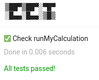

# EET

- 📋 Write and run unit tests in the [Google Earth Engine](https://earthengine.google.com/) code editor
- ☑️ Built-in assertions for easy testing
- 💻 Try out the [interactive demo](https://code.earthengine.google.com/4eb068211c8b1d6acdd3e936cc26eaad)

## Quickstart

First, import the `eet` module:

```javascript
var eet = require("users/aazuspan/eet:eet");
```

Then write your first test using `eet.test`. This function takes a test description (to help you keep track) and a callable function to run during testing.

```javascript
eet.test("Check runMyCalculation", function() {
    var value = runMyCalculation();
    if (value != 42) throw new Error("That should have equaled 42!");
})
```

As you can see, you can write your own tests from scratch by checking conditions and throwing errors, but `eet` has an `assert` module to handle common checks. Here's the same test using the assert module.

```javascript
eet.test("Check runMyCalculation", function() {
    var value = runMyCalculation();
    eet.assert.equal(value, 42);
})
```

Once you've built all your tests, run them and display the results with `eet.run`.

```javascript
eet.run();
```



## API Reference

### Tests

- test(description, function) : Register a function for testing.
- run(*pattern*) : Run tests and report the results. An optional regex pattern can be used to only run matching tests.

### Asserts

Assertions test a specific condition and thrown an error if the condition fails. Most assertions take one or two values to compare and an optional message that will override the default error message. If you're familiar with the Node.js [`assert` module](https://nodejs.org/api/assert.html), the `eet` assertions will look very familiar, as they are generally identicial. Note that `eet` assertions work with **client-side data only**, so use `getInfo` to compare Earth Engine objects. 

- assert.ok(value, *message*) : Value is [truthy](https://developer.mozilla.org/en-US/docs/Glossary/Truthy).
- assert.notOk(value, *message*) : Value is [falsy](https://developer.mozilla.org/en-US/docs/Glossary/Falsy).
- assert.equal(actual, expected, *message*) : Values are equal `==`.
- assert.notEqual(actual, expected, *message*) : Values are not equal `!=`.
- assert.strictEqual(actual, expected, *message*) : Values are strictly equal `===`.
- assert.strictNotEqual(actual, expected, *message*) : Values are strictly not equal `!==`.
- assert.exists(value, *message*) : Value is not `null` or `undefined`.
- assert.notExists(value, *message*) : Value is `null` or `undefined`.
- assert.match(string, regex, *message*) : String matches regex pattern.
- assert.doesNotMatch(string, regex, *message*) : String does not match regex pattern.
- assert.in(value, array, *message*) : Value is in array.
- assert.notIn(value, array, *message*) : Value is not in array.
- assert.throws(fn, *errorLike*, *errMsgMatcher*, *message*) : Function throws error. Specify an Error-like (e.g. `ReferenceError`) to only match specific error types. Specify a regex message pattern to only match errors with a matching error message.
- assert.fail(*message*) : Automatically fail.


